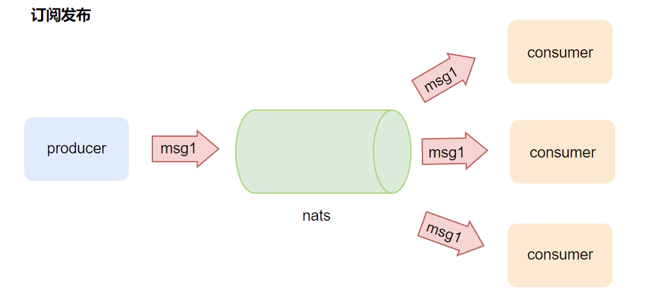
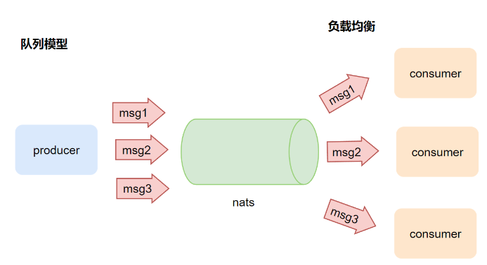
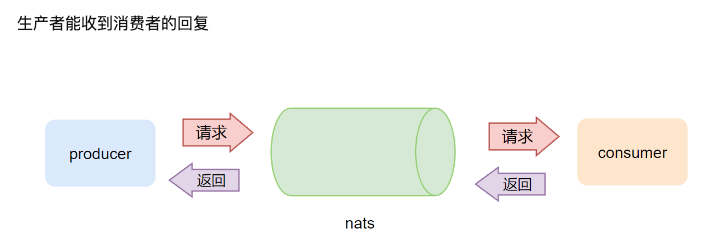
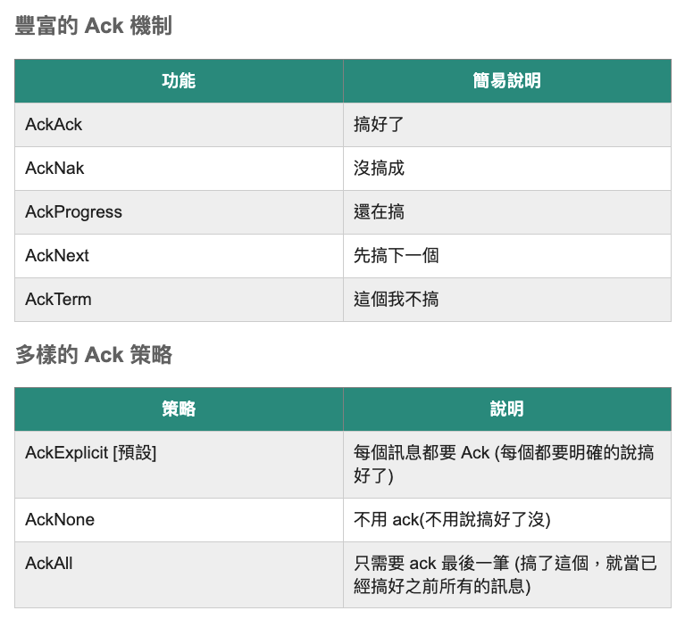
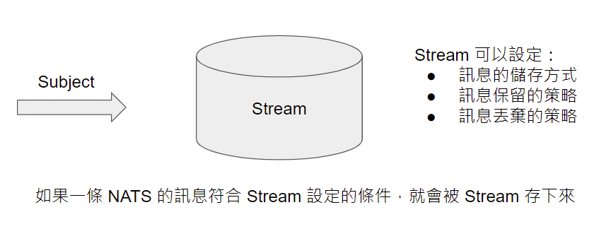

# NATS
purpose: 存放NATS應用筆記, 關於NATS, JetStream

- [NATS]
  - [模式]
    - [發布訂閱-廣播模式](#發布訂閱-廣播模式)
    - [队列模型](#队列模型)
    - [請求響應](#请求响应)
  - [subscribe delivery]
    - [jsonParser](#jsonParser) 
    - [UsingGoChannels](#UsingGoChannels)
  - [關閉連線](#關閉連線)
- [JetStream]
  - [Basic usage](#BasicUsage)
  - [ack機制](#ack機制)
  - [Streams](#Streams)
  - [Consumers](#Consumers)
  - [Continuous polling](#ContinuousPolling)
# 發布訂閱-廣播模式

- 請參考broadcast

# 队列模型

- 主要是透過 subscribe去設定queue name, 同一個queue，只會有一個人收到訊息

# 请求响应

- 应用1-保证消息可靠性
  - nats 本身不做任何的消息的持久化, 是 "最多一次" 交付模型
  - 举个例子, 如果生产的消息没有消费者接, 消息就丢掉了
  - 但是请求响应机制可以通过业务代码保证消息的可靠性, 在业务层面实现常见消息队列的 ACK 机制
    - 举个例子, 生产者发送消息, 消费者接受消息后处理, 成功返回 OK, 失败返回 error, 生产者如果收到 error 或者超时就可以补发消息

# 關閉連線
- sub
  - drain: 在许多 NATS 客户端库中通常有一个特定的方法或函数来支持这个操作。当调用这个方法时，它会停止新的订阅操作，处理队列中的所有消息，然后优雅地关闭订阅者。
    - 平滑关闭：Drain 操作允许订阅者在关闭之前平滑地处理其队列中的所有消息。这意味着，即使你想要关闭或重启订阅者应用，你也可以确保所有待处理的消息都得到了处理。
    - 资源管理：在某些情军下，你可能想要转移订阅者从一个节点到另一个节点，或者在维护期间临时关闭某些订阅者。Drain 功能可以确保在这些情况下消息不会丢失，因为它会等待所有消息处理完成后再关闭订阅者。
    - 优雅的關閉：在云原生应用中，服务的伸缩是常见的操作。当你想要减少订阅者的数量时，Drain 可以确保正在处理的消息被正确地处理，而不是被突然中断。
- nats
  - close: 不等，就是直接關閉
    - 释放资源：关闭与NATS服务器的连接意味着释放与其相关的资源，如网络连接、内存等。
    - 结束连接：当调用close方法时，客户端会结束其与NATS服务器的连接。此后，客户端不能再通过该连接发送或接收消息，除非重新建立连接。
    - 不等待未完成的消息：与drain操作不同，close操作不会等待未处理完的消息。这意味着，如果还有未处理的消息在队列中，那么这些消息可能不会被传递或接收。
  - drain: 等到所有已經接收到的處理完，關閉
    - 停止接收新的消息：订阅者会停止从 NATS 服务器接收新的消息。
    - 处理已接收的消息：即使新消息不再到达，但订阅者仍然会处理队列中已经接收的所有消息。
    - 平滑的关闭连接：一旦队列中的所有消息都被处理完毕，订阅者会优雅地关闭与 NATS 服务器的连接。

# jsonParser
- 傳來的不是msgHandler, 而是直接decoded好的struct
- 要先引入json encoder
```
// Go type Subscriber
c, _ := nats.NewEncodedConn(nc, nats.JSON_ENCODER)
defer c.Close()

c.Subscribe("hello", func(p *person) {
    fmt.Printf("Received a person: %+v\n", p)
})
```
# UsingGoChannels
```go
nc, _ := nats.Connect(nats.DefaultURL)
ec, _ := nats.NewEncodedConn(nc, nats.JSON_ENCODER)
defer ec.Close()

type person struct {
Name     string
Address  string
Age      int
}

recvCh := make(chan *person)
ec.BindRecvChan("hello", recvCh)

sendCh := make(chan *person)
ec.BindSendChan("hello", sendCh)

me := &person{Name: "derek", Age: 22, Address: "140 New Montgomery Street"}

// Send via Go channels
sendCh <- me

// Receive via Go channels
who := <- recvCh
```

# JetSTREAM
## Concept
- Using smaller, simpler interfaces to manage streams and consumers 
- Using more granular and predictable approach to consuming messages from a stream, instead of relying on often complicated and unpredictable Subscribe() method (and all of its flavors)
- Allowing the usage of pull consumers to continuously receive incoming messages (including ordered consumer functionality)
- Separating JetStream context from core NATS

## BasicUsage
```go
package main

import (
  "context"
  "fmt"
  "strconv"
  "time"

  "github.com/nats-io/nats.go"
  "github.com/nats-io/nats.go/jetstream"
)

func main() {
  // In the `jetstream` package, almost all API calls rely on `context.Context` for timeout/cancellation handling
  ctx, cancel := context.WithTimeout(context.Background(), 30*time.Second)
  defer cancel()
  nc, _ := nats.Connect(nats.DefaultURL)

  // Create a JetStream management interface
  js, _ := jetstream.New(nc)

  // Create a stream
  s, _ := js.CreateStream(ctx, jetstream.StreamConfig{
    Name:     "ORDERS",
    Subjects: []string{"ORDERS.*"},
  })

  // Publish some messages
  for i := 0; i < 100; i++ {
    js.Publish(ctx, "ORDERS.new", []byte("hello message "+strconv.Itoa(i)))
    fmt.Printf("Published hello message %d\n", i)
  }

  // Create durable consumer
  c, _ := s.CreateOrUpdateConsumer(ctx, jetstream.ConsumerConfig{
    Durable:   "CONS",
    AckPolicy: jetstream.AckExplicitPolicy,
  })

  // Get 10 messages from the consumer
  messageCounter := 0
  msgs, _ := c.Fetch(10)
  for msg := range msgs.Messages() {
    msg.Ack()
    fmt.Printf("Received a JetStream message via fetch: %s\n", string(msg.Data()))
    messageCounter++
  }
  fmt.Printf("received %d messages\n", messageCounter)
  if msgs.Error() != nil {
    fmt.Println("Error during Fetch(): ", msgs.Error())
  }

  // Receive messages continuously in a callback
  cons, _ := c.Consume(func(msg jetstream.Msg) {
    msg.Ack()
    fmt.Printf("Received a JetStream message via callback: %s\n", string(msg.Data()))
    messageCounter++
  })
  defer cons.Stop()

  // Iterate over messages continuously
  it, _ := c.Messages()
  for i := 0; i < 10; i++ {
    msg, _ := it.Next()
    msg.Ack()
    fmt.Printf("Received a JetStream message via iterator: %s\n", string(msg.Data()))
    messageCounter++
  }
  it.Stop()

  // block until all 100 published messages have been processed
  for messageCounter < 100 {
    time.Sleep(10 * time.Millisecond)
  }
}
```

## ack機制
- 主要是在講，當consumer收到訊息後，可以回傳給publisher的訊息


### 運用ack的應用
#### 「保證一次」交付模型
- 發送端: 要保證「發送端不會重送」，JetStream 的做法是讓生產者可以為每一則訊息自行指定「訊息 ID」， JetStream 會負責確保同樣的「訊息 ID」只會送一次。
```go
_, err = js.Publish("subject", []byte("Hello world"), nats.MsgId("訊息ID"))
if err != nil {
    log.Fatal("送不出去")
}
```
- 接收端
```go
_, err = js.Subscribe("subject", func(msg *nats.Msg) {
    fmt.Println("收到了", string(msg.Data))

    err := msg.AckSync()
    if err != nil {
        log.Println("Ack 沒送成功或是這個訊息 Ack 過了")
    }
})
```

## Streams
- 一種收集器的概念, nats publish subject, stream可以設定哪些subject他要收，並且也可以為stream命名
- jetstream provides methods to manage and list streams, as well as perform stream-specific operations (purging, fetching/deleting messages by sequence id)
- Get and messages from stream
  - Ordered consumers
  - Continuous polling
  - Publishing on stream
 
### Stream management (CRUD)
```go
// Stream management (CRUD)
js, _ := jetstream.New(nc)

js, _ := jetstream.New(nc)

// create a stream (this is an idempotent operation)
s, _ := js.CreateStream(ctx, jetstream.StreamConfig{
    Name:     "ORDERS",
    Subjects: []string{"ORDERS.*"},
})

// update a stream
s, _ = js.UpdateStream(ctx, jetstream.StreamConfig{
    Name:        "ORDERS",
    Subjects:    []string{"ORDERS.*"},
    Description: "updated stream",
})

// get stream handle
s, _ = js.Stream(ctx, "ORDERS")

// delete a stream
js.DeleteStream(ctx, "ORDERS")

```

```go
// Stream-specific operations
// remove all messages from a stream

// get stream handle
s, _ = js.Stream(ctx, "ORDERS")
_ = s.Purge(ctx)

// remove all messages from a stream that are stored on a specific subject
_ = s.Purge(ctx, jetstream.WithPurgeSubject("ORDERS.new"))

// remove all messages up to specified sequence number
_ = s.Purge(ctx, jetstream.WithPurgeSequence(100))

// remove messages, but keep 10 newest
_ = s.Purge(ctx, jetstream.WithPurgeKeep(10))
```

### Listing streams and stream names
```go
// Get and messages from stream
// get message from stream with sequence number == 100
s, _ = js.Stream(ctx, "ORDERS")
msg, _ := s.GetMsg(ctx, 100)

// get last message from "ORDERS.new" subject
msg, _ = s.GetLastMsgForSubject(ctx, "ORDERS.new")

// delete a message with sequence number == 100
_ = s.DeleteMsg(ctx, 100)
```

### Listing streams and stream names
```go
// list streams
streams := js.ListStreams(ctx)
for s := range streams.Info() {
    fmt.Println(s.Config.Name)
}
if streams.Err() != nil {
    fmt.Println("Unexpected error occurred")
}

// list stream names
names := js.StreamNames(ctx)
for name := range names.Name() {
    fmt.Println(name)
}
if names.Err() != nil {
    fmt.Println("Unexpected error occurred")
}
```

## Consumers
- Only `pull consumers` are supported in jetstream package.
### Consumers management

- on JetStream interface
```go
js, _ := jetstream.New(nc)

// create a consumer (this is an idempotent operation)
cons, _ := js.CreateOrUpdateConsumer(ctx, "ORDERS", jetstream.ConsumerConfig{
    Durable: "foo",
    AckPolicy: jetstream.AckExplicitPolicy,
})

// create an ephemeral pull consumer by not providing `Durable`
ephemeral, _ := js.CreateOrUpdateConsumer(ctx, "ORDERS", jetstream.ConsumerConfig{
    AckPolicy: jetstream.AckExplicitPolicy,
})

// get consumer handle
cons, _ = js.Consumer(ctx, "ORDERS", "foo")

// delete a consumer
js.DeleteConsumer(ctx, "ORDERS", "foo")
```

- on Stream interface
```go
// Create a JetStream management interface
js, _ := jetstream.New(nc)

// get stream handle
stream, _ := js.Stream(ctx, "ORDERS") // stream name

// create consumer
cons, _ := stream.CreateOrUpdateConsumer(ctx, jetstream.ConsumerConfig{
    Durable:   "foo", // 消費者斷線時會保留位置，下次訂閱還會從上次最後接收的位置開始 (不包含主動取消訂閱)
    AckPolicy: jetstream.AckExplicitPolicy,
})

// get consumer handle
cons, _ = stream.Consumer(ctx, "ORDERS", "foo") // stream name, consumer name

// delete a consumer
stream.DeleteConsumer(ctx, "foo")
```

- Listing consumers and consumer names
```go
// list consumers
consumers := s.ListConsumers(ctx)
for cons := range consumers.Info() {
    fmt.Println(cons.Name)
}
if consumers.Err() != nil {
    fmt.Println("Unexpected error occurred")
}

// list consumer names
names := s.ConsumerNames(ctx)
for name := range names.Name() {
    fmt.Println(name)
}
if names.Err() != nil {
    fmt.Println("Unexpected error occurred")
}
```

## Ordered consumers
- 根據你設定的stream跟篩選的主題，去拿取資料
- jetstream, in addition to basic named/ephemeral consumers, supports ordered consumer functionality. Ordered is strictly processing messages in the order that they were stored on the stream, providing a consistent and deterministic message ordering. It is also resilient to consumer deletion. 
- Ordered consumers present the same set of message consumption methods as standard `pull consumers`.
```go
js, _ := jetstream.New(nc)

// create a consumer (this is an idempotent operation)
cons, _ := js.OrderedConsumer(ctx, "ORDERS", jetstream.OrderedConsumerConfig{
    // Filter results from "ORDERS" stream by specific subject
    FilterSubjects: []{"ORDERS.A"},
})
```
### Receiving messages from the consumer
- 他比較適合固定時間拉任務，如果你當consume一直拉，效能很差
- Warning: Both Fetch() and FetchNoWait() have worse performance when used to continuously retrieve messages in comparison to Messages() or Consume() methods, as they do not perform any optimizations (pre-buffering) and new subscription is created for each execution.
```go
// receive up to 10 messages from the stream
msgs, _ := c.Fetch(10)
for msg := range msgs.Messages() {
    fmt.Printf("Received a JetStream message: %s\n", string(msg.Data()))
}
if msgs.Error() != nil {
    // handle error
}

// receive up to 1024 B of data
msgs, _ := c.FetchBytes(1024)
for msg := range msgs.Messages() {
    fmt.Printf("Received a JetStream message: %s\n", string(msg.Data()))
}
if msgs.Error() != nil {
    // handle error
}

// FetchNoWait()
// FetchNoWait will not wait for new messages if the whole batch is not available at the time of sending request.
msgs, _ := c.FetchNoWait(10)
for msg := range msgs.Messages() {
    fmt.Printf("Received a JetStream message: %s\n", string(msg.Data()))
}
    if msgs.Error() != nil {
        // handle error
    }
```

## ContinuousPolling
- There are 2 ways to achieve push-like behavior using pull consumers in jetstream package. 
- Both Messages() and Consume() methods perform similar optimizations and for most cases can be used interchangeably.
- There is an advantage of using Messages() instead of Consume() for work-queue scenarios, where messages should be fetched one by one, as it allows for finer control over fetching single messages on demand.
- Subject filtering is achieved by configuring a consumer with a `FilterSubject` value.
- Using `Consume() receive messages in a callback`
### 可以設定參數
```go
/*
Similarly to Messages(), Consume() can be supplied with options to modify the behavior of a single pull request:

PullMaxMessages(int) - up to provided number of messages will be buffered
PullMaxBytes(int) - up to provided number of bytes will be buffered. This setting and PullMaxMessages are mutually exclusive
PullExpiry(time.Duration) - timeout on a single pull request to the server type PullThresholdMessages int
PullThresholdMessages(int) - amount of messages which triggers refilling the buffer
PullThresholdBytes(int) - amount of bytes which triggers refilling the buffer
PullHeartbeat(time.Duration) - idle heartbeat duration for a single pull request. An error will be triggered if at least 2 heartbeats are missed
WithConsumeErrHandler(func (ConsumeContext, error)) - when used, sets a custom error handler on Consume(), allowing e.g. tracking missing heartbeats.
 */

//  example
iter, _ := cons.Messages(jetstream.PullMaxMessages(10), jetstream.PullMaxBytes(1024))
```

### Using Consume() receive messages in a callback
```go
cons, _ := js.CreateOrUpdateConsumer("ORDERS", jetstream.ConsumerConfig{
    AckPolicy: jetstream.AckExplicitPolicy,
    // receive messages from ORDERS.A subject only
    FilterSubject: "ORDERS.A"
}))

consContext, _ := c.Consume(func(msg jetstream.Msg) {
    fmt.Printf("Received a JetStream message: %s\n", string(msg.Data()))
})
defer consContext.Stop()
```

### Using Messages() to iterate over incoming messages
```go
iter, _ := cons.Messages()
for {
    msg, err := iter.Next()
    // Next can return error, e.g. when iterator is closed or no heartbeats were received
    if err != nil {
        //handle error
    }
    fmt.Printf("Received a JetStream message: %s\n", string(msg.Data()))
    msg.Ack()
}
iter.Stop()
```

## Publishing on stream
### Synchronous publish
- 同步
```go
js, _ := jetstream.New(nc)

// Publish message on subject ORDERS.new
// Given subject has to belong to a stream
ack, err := js.PublishMsg(ctx, &nats.Msg{
    Data:    []byte("hello"),
    Subject: "ORDERS.new",
})
fmt.Printf("Published msg with sequence number %d on stream %q", ack.Sequence, ack.Stream)

// A helper method accepting subject and data as parameters
ack, err = js.Publish(ctx, "ORDERS.new", []byte("hello"))
```
- All 3 implementations are work identically
```go
// All 3 implementations are work identically 
ack, err := js.PublishMsg(ctx, &nats.Msg{
    Data:    []byte("hello"),
    Subject: "ORDERS.new",
    Header: nats.Header{
        "Nats-Msg-Id": []string{"id"},
    },
})

ack, err = js.PublishMsg(ctx, &nats.Msg{
    Data:    []byte("hello"),
    Subject: "ORDERS.new",
}, jetstream.WithMsgID("id"))

ack, err = js.Publish(ctx, "ORDERS.new", []byte("hello"), jetstream.WithMsgID("id"))
```
### Async publish
- 非同步
- PublishAsync() and PublishMsgAsync()
```go
js, _ := jetstream.New(nc)

// publish message and do not wait for ack
ackF, err := js.PublishMsgAsync(ctx, &nats.Msg{
    Data:    []byte("hello"),
    Subject: "ORDERS.new",
})

// block and wait for ack
select {
case ack := <-ackF.Ok():
    fmt.Printf("Published msg with sequence number %d on stream %q", ack.Sequence, ack.Stream)
case err := <-ackF.Err():
    fmt.Println(err)
}

// similarly to synchronous publish, there is a helper method accepting subject and data
ackF, err = js.PublishAsync("ORDERS.new", []byte("hello"))
```

# TODO
Wildcard Subscriptions
# Reference
https://zhuanlan.zhihu.com/p/571580368
golang nats official: https://github.com/nats-io/nats.go
golang JetStream official: https://github.com/nats-io/nats.go/blob/main/jetstream/README.md
jetStream example: https://github.com/nats-io/nats.go/tree/main/examples/jetstream
文章: https://marco79423.net/articles/%E6%B7%BA%E8%AB%87-natsstan-%E5%92%8C-jetstream-%E5%85%A9%E4%B8%89%E4%BA%8B
nats official doc: https://docs.nats.io/